# 🎬 AI Video Caption Generator

[](https://www.python.org/)
[](https://streamlit.io/)
[](https://pytest.org/)
[](https://github.com/satya66123/AI-Video-Caption-Generator/actions)
[](LICENSE)
[](https://ollama.com/)
[](https://openai.com/)
[](https://www.anthropic.com/)
[](https://ai.google.dev/)
[](https://mistral.ai/)
[](https://groq.com/)
[](https://cohere.com/)
[](https://www.deepseek.com/)
[](https://github.com/openai/whisper)
[](https://ffmpeg.org/)
[](https://github.com/satya66123)

An AI-powered video caption generation application built with Python and Streamlit.

The application processes uploaded videos, detects spoken language, generates timestamped captions, translates captions
into supported languages using a selectable AI provider and model, exports SRT/VTT files, and permanently burns captions
into the final video using FFmpeg.

---

# 📌 Stable Releases

The project has evolved through five major stable releases.

| Version    | Status     | Main Scope                                    |
|------------|------------|-----------------------------------------------|
| **v1.0.0** | ✅ Stable   | Ollama-based core caption generation          |
| **v1.1.0** | ✅ Stable   | Multi-provider AI translation                 |
| **v1.2.0** | ✅ Stable   | Timestamped transcript saving                 |
| **v1.3.0** | ✅ Stable   | Multi-provider + multi-model AI translation   |
| **v1.4.1** | 🚀 Current | Tab frontend, 15 themes, multi-model Settings |
| **v1.4.0** | ✅ Stable   | Custom application theme selection            |

## Release Evolution

```text
v1.0.0
Ollama-Based AI
      ↓
One Translation Model
      ↓
Core Caption Generator
```

```text
v1.1.0
Multiple AI Providers
      ↓
One Default Model per Provider
      ↓
Multi-Provider Translation
```

```text
v1.2.0
Multiple AI Providers
      ↓
One Default Model per Provider
      ↓
Timestamped Transcript Saving
      ↓
Transcript Download
```

---

```text
v1.3.0
Multiple AI Providers
      ↓
Multiple Models per Provider
      ↓
Provider + Model Selection
      ↓
Multi-Model Translation
```

---

```text
v1.4.0
Multiple AI Providers
      ↓
Multiple Models per Provider
      ↓
Provider + Model Selection
      ↓
Custom Theme Selection
```

---

---

# 🚀 v1.4.1 — Frontend, Themes & Multi-Model Settings

**Current stable release**

v1.4.1 builds on v1.4.0 while preserving the existing release history and core caption-processing architecture.

## v1.4.1 Highlights

* 🖥️ Added tab-based frontend navigation through `apptab.py`
* 🧩 Kept `app.py` as the primary Streamlit application entry point
* 🏠 Dashboard remains the default tab
* 🎬 Caption Generator, 📄 Captions, ⚙️ Settings, ❓ Help and ℹ️ About tabs
* 🎨 Expanded theme support to **15 themes**
* 🌙 5 dark themes and ☀️ 10 light themes
* 🖤 Improved black/dark text visibility on light themes
* 🔽 Improved dropdown/selectbox readability
* 📝 Improved caption text visibility
* 🕐 Improved Recent Files readability and styling
* 🤖 8 AI providers
* 🧠 Multiple selectable models per provider
* 🔀 Dynamic Provider → Model selection
* 🌐 Original spoken-language detection remains visible
* 📄 Transcript, SRT and VTT generation preserved
* 🔥 FFmpeg caption burning preserved
* 💾 Original video preservation preserved
* 🛠️ Help and Troubleshooting expanded
* ℹ️ About documentation expanded
* 📁 Project folder documentation added
* 🧪 **267 automated tests passing**

## v1.4.1 Frontend

```text
                    Streamlit Application
                            │
                 ┌──────────┴──────────┐
                 │                     │
               app.py              apptab.py
                 │                     │
                 │              Tab Navigation
                 │                     │
                 └──────────┬──────────┘
                            ↓
                     Existing Workflow
                            ↓
                  Agents / Services / Providers
                            ↓
                     Caption Generation
```

The tab frontend is a UI/navigation enhancement. Existing agents, services,
providers, transcription, caption generation, SRT/VTT creation and FFmpeg
processing remain preserved.

## v1.4.1 Tabs

```text
🏠 Dashboard
🎬 Caption Generator
📄 Captions
⚙️ Settings
❓ Help
ℹ️ About
```

**Default tab:** 🏠 Dashboard

## v1.4.1 Settings

```text
🎨 Theme
    ↓
🤖 AI Provider
    ↓
🧠 Provider-specific Model
    ↓
🌐 Default Caption Language
```

The model list changes dynamically according to the selected provider.

## v1.4.1 AI Providers

The release supports eight providers:

```text
Ollama
OpenAI
Anthropic
Gemini
Mistral
Groq
Cohere
DeepSeek
```

### Ollama — 9 Models

```text
qwen2.5:1.5b
gemma2:2b
gemma3:4b
mistral:latest
phi3:latest
qwen3:latest
llama3.1:latest
llama3:8b
deepseek-coder:latest
```

### OpenAI — 3 Models

```text
gpt-5-mini
gpt-4o
gpt-4o-mini
```

### Anthropic — 3 Models

```text
claude-sonnet-4-5
claude-haiku-4-5
claude-opus-4-1
```

### Gemini — 3 Models

```text
gemini-3.6-flash
gemini-2.5-flash
gemini-2.5-pro
```

### Mistral — 3 Models

```text
mistral-medium-latest
mistral-large-latest
mistral-small-latest
```

### Groq — 3 Models

```text
llama-3.3-70b-versatile
llama-3.1-8b-instant
mixtral-8x7b-32768
```

### Cohere — 3 Models

```text
command-a-03-2025
command-r-plus
command-r
```

### DeepSeek — 3 Models

```text
deepseek-chat
deepseek-reasoner
deepseek-v4-flash
```

## v1.4.1 Themes

### 🌙 Dark Themes

```text
🌙 Dark
🌌 Midnight Blue
💜 Cosmic Purple
🌊 Ocean
🌿 Emerald
```

### ☀️ Light Themes

```text
☀️ Light
🌤️ Sky Light
💜 Lavender Light
🌿 Mint Light
🌊 Aqua Light
🌸 Rose Light
🍑 Peach Light
🌼 Amber Light
🩵 Ice Light
🌱 Sage Light
```

Light themes use dark/black interface text for readability, including
captions and Recent Files.

## v1.4.1 Help & Troubleshooting

Help covers:

* 📖 Usage and workflow
* 🎥 Supported video formats
* 📄 SRT/VTT formats
* 🤖 AI processing
* 🧠 Provider/model selection
* 🦙 Ollama troubleshooting
* 🔑 Cloud API-key troubleshooting
* 📝 Whisper/transcription troubleshooting
* 🌐 Language detection troubleshooting
* 📄 SRT/VTT generation troubleshooting
* 🔥 FFmpeg troubleshooting
* 💾 Generated-file troubleshooting
* 🎨 Theme troubleshooting
* 🔄 Settings/session troubleshooting

## v1.4.1 About

About documents:

* Current release
* Complete workflow
* All versions from v1.0.0 through v1.4.1
* AI providers and models
* 15 application themes
* Project folders
* Technology stack
* Testing status
* Project scope

## v1.4.1 Project Folders

```text
uploads/
    original uploaded videos

transcripts/
    timestamped transcript files

captions/
    generated SRT files
    generated VTT files

outputs/
    final captioned videos
```

## v1.4.1 Screenshots

The existing application screenshots are retained below and continue to document
the Dashboard, Caption Generator, upload, language detection, caption generation,
caption burning, final captioned video, Settings, Help and About screens.

Additional v1.4.1 UI screenshots can be added to `docs/screenshots/` and referenced
without changing the existing screenshot documentation.

## v1.4.1 Verification

```text
267 passed
0 failed
100% pass rate
```

---

# 🚀 v1.4.0 — Custom Theme Selection

**Current stable release**

v1.4.0 adds **custom application theme selection** directly to the sidebar while preserving the multi-provider,
multi-model, transcript, caption, and video-processing features from previous releases.

## v1.4.0 Highlights

* 🎨 **Custom theme selection from the sidebar**
* 🌙 Dark theme
* 🌌 Midnight Blue theme
* 💜 Cosmic Purple theme
* 🌊 Ocean theme
* 🌿 Emerald theme
* ❌ Light theme removed
* 🧠 Multi-model provider selection preserved
* 🤖 Multi-provider AI translation preserved
* 📝 Timestamped transcript saving preserved
* ⬇️ Transcript download preserved
* 🎥 SRT/VTT generation preserved
* 🔥 FFmpeg caption burning preserved
* 💾 Original uploaded video preservation preserved
* 🧪 **231 automated tests passing**
* 🔄 GitHub Actions CI preserved

## v1.4.0 Theme Selection

Themes are available from the application sidebar:

```text
🎨 Theme

🌙 Dark
🌌 Midnight Blue
💜 Cosmic Purple
🌊 Ocean
🌿 Emerald
```

The selected theme is stored in the Streamlit session and applied to the application UI.

## v1.4.0 Theme Flow

```text
Open Application
      ↓
Open Sidebar
      ↓
Select Theme
      ↓
Apply Theme
      ↓
Continue Video Caption Workflow
```

## v1.4.0 Verification

```text
231 passed
0 failed
100% pass rate
21.39 seconds
```

The v1.4.0 test suite includes the existing project coverage plus the new theme-related tests.

---

# 🚀 v1.3.0 — Multi-Provider + Multi-Model AI Translation

**Current stable release**

v1.3.0 extends the multi-provider architecture introduced in v1.1.0 by adding **multi-model support**.

Users can now select:

1. An AI provider
2. A model available for that provider

directly from the application sidebar.

## v1.3.0 Evolution

v1.0.0 started with a local Ollama-based translation workflow using a single configured model.

v1.1.0 introduced multiple AI providers, with one configured/default model for each provider.

v1.3.0 introduces multiple models per provider, allowing users to dynamically choose the provider and model used for
translation.

```text
Provider
   ↓
Select Provider
   ↓
Available Models for Provider
   ↓
Select Model
   ↓
Translation Provider Factory
   ↓
Generate Captions
```

## v1.3.0 Providers

| Provider     | Mode  | Example Models                                                          |
|--------------|-------|-------------------------------------------------------------------------|
| 🦙 Ollama    | Local | `qwen2.5:1.5b`, `gemma3:4b`, `mistral:latest`                           |
| 🟢 OpenAI    | API   | `gpt-5-mini`, `gpt-4o`, `gpt-4o-mini`                                   |
| 🟣 Anthropic | API   | `claude-sonnet-4-5`, `claude-haiku-4-5`, `claude-opus-4-1`              |
| 🔵 Gemini    | API   | `gemini-2.5-flash`, `gemini-2.5-pro`, `gemini-2.0-flash`                |
| 🟠 Mistral   | API   | `mistral-medium-latest`, `mistral-large-latest`, `mistral-small-latest` |
| ⚡ Groq       | API   | `llama-3.3-70b-versatile`, `llama-3.1-8b-instant`, `mixtral-8x7b-32768` |
| 🟪 Cohere    | API   | `command-a-03-2025`, `command-r-plus`, `command-r`                      |
| 🔷 DeepSeek  | API   | `deepseek-chat`, `deepseek-reasoner`, `deepseek-v4-flash`               |

> Model availability depends on the provider and the provider API/account configuration.

## v1.3.0 Highlights

* 🤖 Multi-provider AI translation
* 🧠 **Multi-model support**
* 🔀 Provider + model selection
* 🧭 Provider selection from the sidebar
* 🎯 Model selection dynamically based on the selected provider
* 🦙 Multiple Ollama models
* 🟢 Multiple OpenAI models
* 🟣 Multiple Anthropic models
* 🔵 Multiple Gemini models
* 🟠 Multiple Mistral models
* ⚡ Multiple Groq models
* 🟪 Multiple Cohere models
* 🔷 Multiple DeepSeek models
* 🔌 Translation Provider Factory
* ⚙️ Provider and model configuration in Settings
* 🔐 Environment-based API-key configuration
* 🔒 API keys remain hidden from the UI
* 🧪 Expanded provider and model test coverage
* 🔄 GitHub Actions CI preserved
* 🎥 SRT/VTT generation preserved
* 🔥 FFmpeg caption burning preserved
* 💾 Original uploaded video preservation preserved

## v1.3.0 Sidebar Selection

```text
🤖 AI Provider

Provider
┌─────────────────────────────┐
│ OpenAI                   ▼  │
└─────────────────────────────┘

Model
┌─────────────────────────────┐
│ gpt-5-mini               ▼  │
└─────────────────────────────┘
```

When the provider changes, the model list changes automatically.

Example:

```text
Ollama
  ├── qwen2.5:1.5b
  ├── gemma3:4b
  └── mistral:latest
```

```text
OpenAI
  ├── gpt-5-mini
  ├── gpt-4o
  └── gpt-4o-mini
```

```text
Anthropic
  ├── claude-sonnet-4-5
  ├── claude-haiku-4-5
  └── claude-opus-4-1
```

## v1.3.0 Translation Flow

```text
Upload Video
      ↓
Save Original Video
      ↓
Whisper Transcription
      ↓
Language Detection
      ↓
Select Caption Language
      ↓
Select AI Provider
      ↓
Select AI Model
      ↓
Translation Provider Factory
      ↓
┌──────────────────────────────────────────────┐
│ Ollama / OpenAI / Anthropic / Gemini         │
│ Mistral / Groq / Cohere / DeepSeek           │
└──────────────────────────────────────────────┘
      ↓
Generate SRT + VTT
      ↓
FFmpeg Caption Burn
      ↓
Final Captioned Video
```

## v1.3.0 Verification

```text
231 passed
0 failed
100% pass rate
```

Provider and integration coverage includes:

```text
Ollama       → Provider tests ✅
OpenAI       → Provider tests ✅
Anthropic    → Provider tests ✅
Gemini       → Provider tests ✅
Mistral      → Provider tests ✅
Groq         → Provider tests ✅
Cohere       → Provider tests ✅
DeepSeek     → Provider tests ✅
Factory      → Integration tests ✅
Settings     → Provider configuration tests ✅
Full Suite   → 217 tests passed ✅
```

---

# 🚀 v1.1.0 — Multi-Provider AI Translation

**Stable release**

v1.1.0 introduced multi-provider AI translation to the original v1.0.0 Ollama-based architecture.

The application moved from a single AI provider to multiple selectable providers.

However, v1.1.0 used **one configured/default model per provider**.

## v1.1.0 Architecture

```text
Provider Selection
       ↓
┌────────────────────────────┐
│ Ollama                     │
│ OpenAI                     │
│ Anthropic                  │
│ Gemini                     │
└─────────────┬──────────────┘
              ↓
     One Default Model
       per Provider
              ↓
Translation Provider Factory
              ↓
Generate Captions
```

## v1.1.0 Providers

| Provider     | Default Model       | Mode  |
|--------------|---------------------|-------|
| 🦙 Ollama    | `qwen2.5:1.5b`      | Local |
| 🟢 OpenAI    | `gpt-5-mini`        | API   |
| 🟣 Anthropic | `claude-sonnet-4-5` | API   |
| 🔵 Gemini    | `gemini-3.6-flash`  | API   |

## v1.1.0 Highlights

* 🤖 Multi-provider AI translation
* 🦙 Ollama translation
* 🟢 OpenAI translation
* 🟣 Anthropic translation
* 🔵 Gemini translation
* 🎯 One default model per provider
* 🧭 Provider selection from the sidebar
* 🧠 Provider and model stored in Streamlit session state
* 🔌 Translation Provider Factory
* 🔐 Environment-based API-key configuration
* 🔒 API keys never displayed in the UI
* ⚙️ Provider configuration/status in Settings
* 🧪 Expanded test coverage
* 🔄 GitHub Actions CI
* 🎥 SRT/VTT generation preserved
* 🔥 FFmpeg caption burning preserved
* 💾 Original uploaded video preserved

## v1.1.0 Flow

```text
Upload Video
     ↓
Save Original Video
     ↓
Whisper Transcription
     ↓
Language Detection
     ↓
Select Caption Language
     ↓
Select AI Provider
     ↓
Provider's Default Model
     ↓
Translation Provider Factory
     ↓
Generate SRT + VTT
     ↓
FFmpeg Caption Burn
     ↓
Final Captioned Video
```

## v1.1.0 Verification

```text
177 automated tests
0 failed
100% pass rate
```

The complete workflow was manually verified for:

```text
Ollama     → SRT + VTT + Captioned Video + Original Video ✅
OpenAI     → SRT + VTT + Captioned Video + Original Video ✅
Anthropic  → SRT + VTT + Captioned Video + Original Video ✅
Gemini     → SRT + VTT + Captioned Video + Original Video ✅
```

---

# 🎬 v1.0.0 — Core Ollama Caption Generator

**Original stable release**

v1.0.0 was the original **Ollama-based local AI release**.

The initial version used one configured Ollama translation model together with Whisper and FFmpeg.

## v1.0.0 Architecture

```text
Video
  ↓
Whisper Transcription
  ↓
Language Detection
  ↓
Ollama
  ↓
One Local Translation Model
  ↓
SRT + VTT
  ↓
FFmpeg
  ↓
Final Captioned Video
```

## v1.0.0 Core Model

```text
qwen2.5:1.5b
```

## v1.0.0 Highlights

* 🎬 Video upload
* 📝 Whisper timestamped transcription
* 🌐 Spoken-language detection
* 💬 Multilingual caption generation
* 🦙 Local Ollama translation
* 🎯 Single configured translation model
* 📄 SRT generation
* 📄 VTT generation
* 🔥 FFmpeg caption burning
* 🎥 Final captioned-video preview
* 💾 Original video preservation
* 📊 Dashboard
* ⚙️ Settings
* ❓ Help
* ℹ️ About
* 🧪 Automated testing
* 🔄 GitHub Actions CI

## v1.0.0 Workflow

```text
Upload
  ↓
Transcribe with Whisper
  ↓
Detect Language
  ↓
Translate with Ollama
  ↓
Generate SRT + VTT
  ↓
Burn Captions with FFmpeg
  ↓
Final Captioned Video
```

---

# ✨ Features

## 🎬 Video Processing

* Video upload
* Original video preservation
* Local video storage
* MP4 support
* MOV support
* AVI support
* MKV support
* WebM support

## 📝 Transcription

* OpenAI Whisper transcription
* Timestamped transcript segments
* Spoken-language detection
* Timestamped transcript file saving
* Transcript download
* Internal transcript processing

## 🌐 Caption Languages

* English
* Telugu
* Hindi
* Tamil
* Kannada
* Malayalam
* Bengali
* Marathi
* Gujarati
* Punjabi

## 🤖 AI Translation

### Local

* Ollama

### Cloud Providers

* OpenAI
* Anthropic
* Gemini
* Mistral
* Groq
* Cohere
* DeepSeek

## 🧠 Multi-Model Support

Starting with v1.3.0, users can select multiple models depending on the selected provider.

```text
Select Provider
      ↓
Load Provider Models
      ↓
Select Model
      ↓
Run Translation
```

## 🎨 Theme Selection

v1.4.0 adds selectable application themes from the sidebar.

Available themes:

* 🌙 Dark
* 🌌 Midnight Blue
* 💜 Cosmic Purple
* 🌊 Ocean
* 🌿 Emerald

The selected theme is stored for the current Streamlit session.

## 📄 Caption Formats

* SRT
* VTT

## 🔥 Video Caption Burning

FFmpeg permanently burns the generated captions into the final video.

## 📊 Dashboard

* Total videos
* Generated caption files
* Captioned videos
* Recent files

## ⚙️ Settings

* Whisper model selection
* AI provider selection
* AI model selection
* Default caption language
* Provider configuration/status
* Application theme selection

## 🧪 Testing

* PyTest automated tests
* Provider tests
* Factory tests
* Settings tests
* Service tests
* Agent tests
* GitHub Actions CI

---

# 🧩 Core Workflow

```text
┌──────────────────────┐
│     Upload Video     │
└──────────┬───────────┘
           ↓
┌──────────────────────┐
│ Save Original Video  │
└──────────┬───────────┘
           ↓
┌──────────────────────┐
│ Whisper Transcription│
└──────────┬───────────┘
           ↓
┌──────────────────────┐
│ Language Detection   │
└──────────┬───────────┘
           ↓
┌──────────────────────┐
│ Select Caption Lang. │
└──────────┬───────────┘
           ↓
┌───────────────────────────────┐
│ Select AI Provider            │
│                               │
│ Ollama / OpenAI / Anthropic   │
│ Gemini / Mistral / Groq       │
│ Cohere / DeepSeek             │
└──────────────┬────────────────┘
               ↓
┌───────────────────────────────┐
│ Select AI Model               │
│                               │
│ Model list depends on        │
│ selected provider             │
└──────────────┬────────────────┘
               ↓
┌───────────────────────────────┐
│ Translation Provider Factory  │
└──────────────┬────────────────┘
               ↓
       ┌───────┴───────┐
       ↓               ↓
┌───────────┐     ┌───────────┐
│    SRT    │     │    VTT    │
└─────┬─────┘     └─────┬─────┘
      └─────────┬───────┘
                ↓
┌──────────────────────┐
│ FFmpeg Caption Burn  │
└──────────┬───────────┘
           ↓
┌──────────────────────┐
│ Final Captioned      │
│ Video                │
└──────────────────────┘
```

---

# 🌐 Supported Caption Languages

| Code | Language  |
|------|-----------|
| `en` | English   |
| `te` | Telugu    |
| `hi` | Hindi     |
| `ta` | Tamil     |
| `kn` | Kannada   |
| `ml` | Malayalam |
| `bn` | Bengali   |
| `mr` | Marathi   |
| `gu` | Gujarati  |
| `pa` | Punjabi   |

---

# 📄 Caption Formats

The application generates:

### SRT

SubRip Subtitle format.

### VTT

WebVTT format.

Both formats contain timestamped caption segments.

---

# 🎥 Supported Video Formats

* MP4
* MOV
* AVI
* MKV
* WebM

---

# 🛠️ Technology Stack

| Technology             | Purpose                              |
|------------------------|--------------------------------------|
| Python 3.11            | Application development              |
| Streamlit              | Web UI                               |
| OpenAI Whisper         | Speech transcription                 |
| Ollama                 | Local AI translation                 |
| OpenAI                 | AI translation provider              |
| Anthropic              | AI translation provider              |
| Gemini                 | AI translation provider              |
| Mistral                | AI translation provider              |
| Groq                   | AI translation provider              |
| Cohere                 | AI translation provider              |
| DeepSeek               | AI translation provider              |
| Qwen / Gemma / Mistral | Local model support                  |
| FFmpeg                 | Video processing and caption burning |
| PyTest                 | Automated testing                    |
| JSON / Local Files     | Lightweight storage                  |
| GitHub Actions         | Continuous integration               |

---

# 🤖 AI Provider Architecture

The application uses a provider abstraction so translation logic is separated from provider-specific implementations.

```text
                    Translation Provider
                            │
                            ▼
                 Translation Provider Factory
                            │
        ┌───────────┬───────┴───────┬───────────┐
        ↓           ↓               ↓           ↓
     Ollama      OpenAI         Anthropic     Gemini

        ┌───────────┬───────────┬───────────┐
        ↓           ↓           ↓           ↓
     Mistral      Groq        Cohere      DeepSeek
```

The provider is selected first, and the available models are then loaded for that provider.

---

# 🦙 Local AI with Ollama

The project supports local AI translation through Ollama.

Example models:

```text
qwen2.5:1.5b
gemma3:4b
mistral:latest
```

Install Ollama and verify it:

```powershell
ollama --version
```

Check installed models:

```powershell
ollama list
```

Pull the default model:

```powershell
ollama pull qwen2.5:1.5b
```

Start Ollama if required:

```powershell
ollama serve
```

> Make sure the selected Ollama model is installed locally before generating translated captions.

---

# 🔐 Cloud Provider Configuration

Cloud providers use environment variables for API keys.

Example:

```env
OPENAI_API_KEY=
ANTHROPIC_API_KEY=
GEMINI_API_KEY=
MISTRAL_API_KEY=
GROQ_API_KEY=
COHERE_API_KEY=
DEEPSEEK_API_KEY=
```

API keys should never be committed to Git.

Use a local `.env` file and keep it excluded from version control.

---

# 🔥 FFmpeg

FFmpeg is used to permanently burn captions into the generated video.

Verify FFmpeg:

```powershell
ffmpeg -version
```

FFmpeg must be installed and available on the system `PATH`.

---

# 📁 Project Structure

```text
AI-Video-Caption-Generator/
│
├── .github/
│   └── workflows/
│       └── python-app.yml
│
├── agents/
│   ├── __init__.py
│   ├── caption_agent.py
│   └── dashboard_agent.py
│
├── config/
│   └── caption_config.py
│
├── core/
│   └── caption_models.py
│
├── pages/
│   ├── about_agent.py
│   ├── dashboard_agent.py
│   ├── help_agent.py
│   └── settings_agent.py
│
├── providers/
│   ├── translation_provider.py
│   ├── ollama_translation_provider.py
│   ├── openai_translation_provider.py
│   ├── anthropic_translation_provider.py
│   ├── gemini_translation_provider.py
│   ├── mistral_translation_provider.py
│   ├── groq_translation_provider.py
│   ├── cohere_translation_provider.py
│   ├── deepseek_translation_provider.py
│   └── translation_provider_factory.py
│
├── services/
│   ├── caption_generation_service.py
│   ├── caption_file_service.py
│   ├── language_detection_service.py
│   ├── transcript_service.py
│   └── video_caption_burn_service.py
│
├── tests/
│   ├── test_*.py
│   └── ...
│
├── uploads/
│   └── .gitkeep
│
├── captions/
│   └── .gitkeep
│
├── outputs/
│   └── .gitkeep
│
├── app.py
├── apptab.py
├── requirements.txt
├── LICENSE
└── README.md
```

---

# 🚀 Installation

## 1. Clone the Repository

```powershell
git clone https://github.com/satya66123/AI-Video-Caption-Generator.git
cd AI-Video-Caption-Generator
```

## 2. Create a Virtual Environment

Windows:

```powershell
python -m venv .venv
```

Activate it:

```powershell
.venv\Scripts\activate
```

## 3. Install Python Dependencies

```powershell
python -m pip install --upgrade pip
pip install -r requirements.txt
```

## 4. Install System Dependencies

Install:

* FFmpeg
* Ollama

Verify:

```powershell
python --version
ffmpeg -version
ollama --version
```

## 5. Install an Ollama Model

```powershell
ollama pull qwen2.5:1.5b
```

Additional models can be installed when required.

## 6. Configure Cloud Providers

If using cloud providers, configure the required API keys in `.env`.

Example:

```env
OPENAI_API_KEY=
ANTHROPIC_API_KEY=
GEMINI_API_KEY=
MISTRAL_API_KEY=
GROQ_API_KEY=
COHERE_API_KEY=
DEEPSEEK_API_KEY=
```

## 7. Run the Application

```powershell
streamlit run app.py
```

The application will open in your browser.

---

# 🖥️ Application Navigation

The application provides a sidebar navigation and configuration controls:

```text
🎨 Theme
🤖 AI Provider
🧠 AI Model
🌐 Caption Language
```

Navigation:

```text
🏠 Dashboard
🎬 Caption Generator
📄 Captions
⚙️ Settings
❓ Help
ℹ️ About
```

---

# 🏠 Dashboard

The Dashboard displays:

* Total videos
* Generated caption files
* Captioned videos
* Recent generated files

Git placeholder files such as `.gitkeep` are excluded from Recent Files.

---

# 🎬 Caption Generator

The main workflow is:

1. Upload a video
2. Save the original video
3. Detect spoken language
4. Select caption language
5. Select AI provider
6. Select AI model
7. Generate captions
8. Download SRT/VTT
9. Burn captions into the video
10. Preview/download the final captioned video

---

# 📄 Captions

The Captions page allows users to browse generated:

* SRT files
* VTT files

Caption contents can be viewed and downloaded.

---

# ⚙️ Settings

The Settings page provides configuration for:

* Whisper model
* AI provider
* AI model
* Default caption language
* Provider configuration
* API-key status
* Application theme

## Provider → Model Selection

In v1.3.0, the model selection is dependent on the selected provider.

```text
Provider
   ↓
Ollama
   ↓
Ollama Models
```

or:

```text
Provider
   ↓
OpenAI
   ↓
OpenAI Models
```

This prevents an invalid combination such as:

```text
Provider: OpenAI
Model: qwen2.5:1.5b
```

Instead:

```text
Provider: OpenAI
Model: gpt-5-mini
```

---

# ❓ Help

The Help page provides:

* Usage instructions
* Supported video formats
* Supported caption formats
* AI processing information
* Ollama troubleshooting
* Translation model troubleshooting
* FFmpeg troubleshooting

---

# ℹ️ About

The About page provides:

* Project overview
* Core workflow
* Technology stack
* Project scope
* Current application version

---

# 🧪 Testing

The project contains a comprehensive PyTest suite.

Run all tests:

```powershell
pytest
```

Run with verbose output:

```powershell
pytest -v
```

Run a specific test file:

```powershell
pytest tests/test_dashboard_agent.py -v
```

## Current Test Status

```text
231 passed
0 failed
100% pass rate
21.39 seconds
```

The test suite covers the application components, including:

* Agents
* Services
* Translation providers
* Translation Provider Factory
* Settings
* Configuration
* Caption generation
* Caption files
* Video caption burning

---

# 🔄 GitHub Actions

The project includes a GitHub Actions workflow:

```text
.github/workflows/python-app.yml
```

The workflow:

1. Checks out the repository
2. Sets up Python 3.11
3. Installs dependencies
4. Runs the PyTest suite

Every configured push and pull request is automatically tested.

---

# 📊 Release Comparison

| Capability                         | v1.0.0 | v1.1.0 | v1.2.0 | v1.3.0 | v1.4.0 |
|------------------------------------|:------:|:------:|:------:|:------:|:------:|
| Video upload                       |   ✅    |   ✅    |   ✅    |   ✅    |   ✅    |
| Original video preservation        |   ✅    |   ✅    |   ✅    |   ✅    |   ✅    |
| Whisper transcription              |   ✅    |   ✅    |   ✅    |   ✅    |   ✅    |
| Language detection                 |   ✅    |   ✅    |   ✅    |   ✅    |   ✅    |
| Timestamped transcript saving      |   ❌    |   ❌    |   ✅    |   ✅    |   ✅    |
| Transcript download                |   ❌    |   ❌    |   ✅    |   ✅    |   ✅    |
| SRT generation                     |   ✅    |   ✅    |   ✅    |   ✅    |   ✅    |
| VTT generation                     |   ✅    |   ✅    |   ✅    |   ✅    |   ✅    |
| FFmpeg caption burning             |   ✅    |   ✅    |   ✅    |   ✅    |   ✅    |
| Captioned video output             |   ✅    |   ✅    |   ✅    |   ✅    |   ✅    |
| Dashboard                          |   ✅    |   ✅    |   ✅    |   ✅    |   ✅    |
| Settings / Help / About            |   ✅    |   ✅    |   ✅    |   ✅    |   ✅    |
| Ollama translation                 |   ✅    |   ✅    |   ✅    |   ✅    |   ✅    |
| Multiple AI providers              |   ❌    |   ✅    |   ✅    |   ✅    |   ✅    |
| Multiple models per provider       |   ❌    |   ❌    |   ❌    |   ✅    |   ✅    |
| Provider selection                 |   ❌    |   ✅    |   ✅    |   ✅    |   ✅    |
| Model selection                    |   ❌    |   ❌    |   ❌    |   ✅    |   ✅    |
| Dynamic Provider → Model selection |   ❌    |   ❌    |   ❌    |   ✅    |   ✅    |
| Translation Provider Factory       |   ❌    |   ✅    |   ✅    |   ✅    |   ✅    |
| Environment API-key handling       |   ❌    |   ✅    |   ✅    |   ✅    |   ✅    |
| Theme selection                    |   ❌    |   ❌    |   ❌    |   ❌    |   ✅    |
| Automated tests                    |  153   |  177   |   —    |  217   |  231   |
| GitHub Actions                     |   ✅    |   ✅    |   ✅    |   ✅    |   ✅    |
| Manual E2E verification            |   ✅    |   ✅    |   ✅    |   ✅    |   ✅    |

---

# 📸 Application Screenshots

## 🏠 Dashboard

Main dashboard showing video statistics and recent generated files.

<p align="center">
  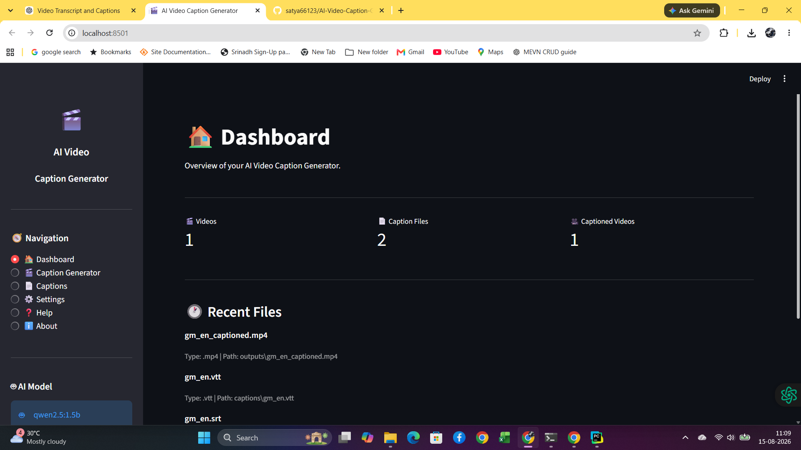
</p>

---

## 🎬 Caption Generator

Main caption-generation interface.

<p align="center">
  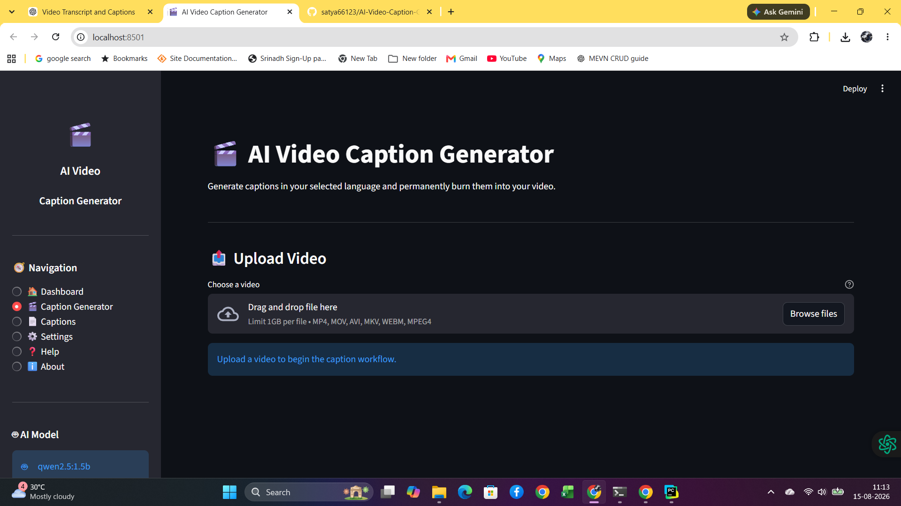
</p>

---

## 📤 Video Upload

Video uploaded successfully and ready for processing.

<p align="center">
  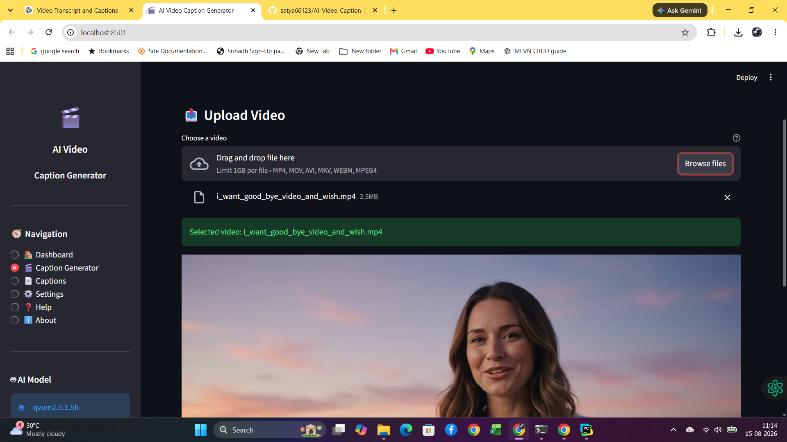
</p>

---

## 💾 Original Video Saved

The original uploaded video is preserved separately.

<p align="center">
  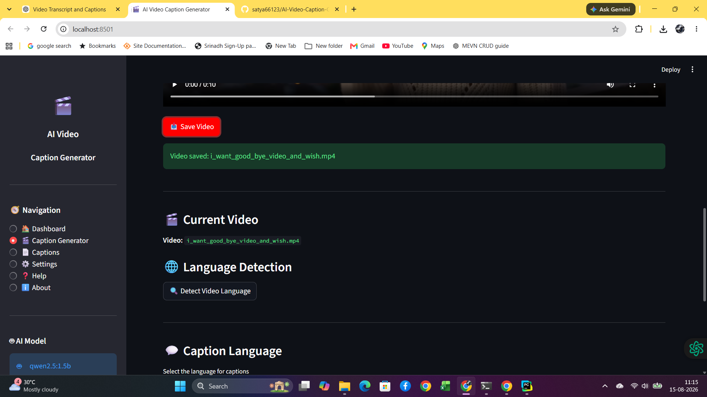
</p>

---

## 🌐 Language Detection

Detected spoken language used for caption processing.

<p align="center">
  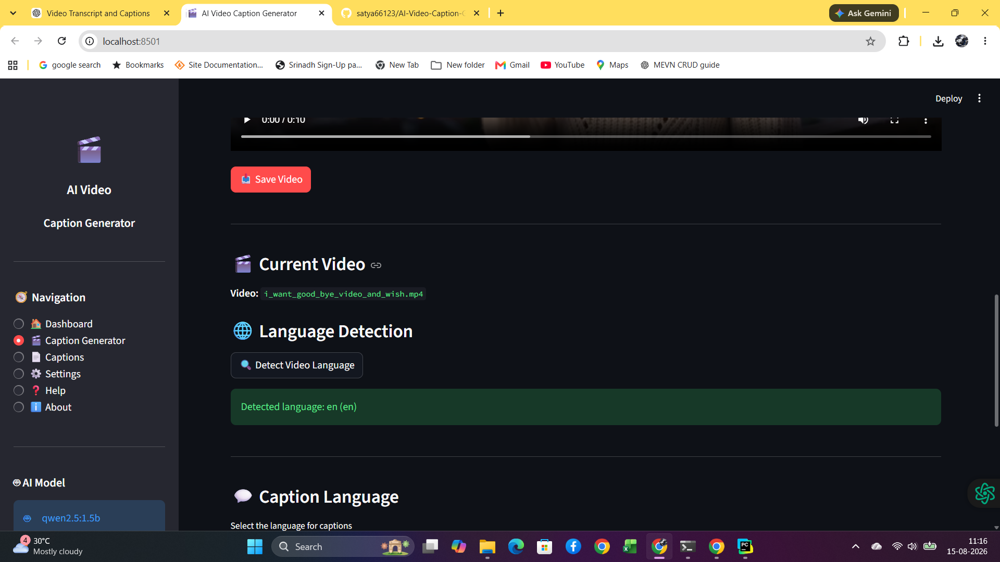
</p>

---

## 📝 Caption Generation

Caption generation in progress.

<p align="center">
  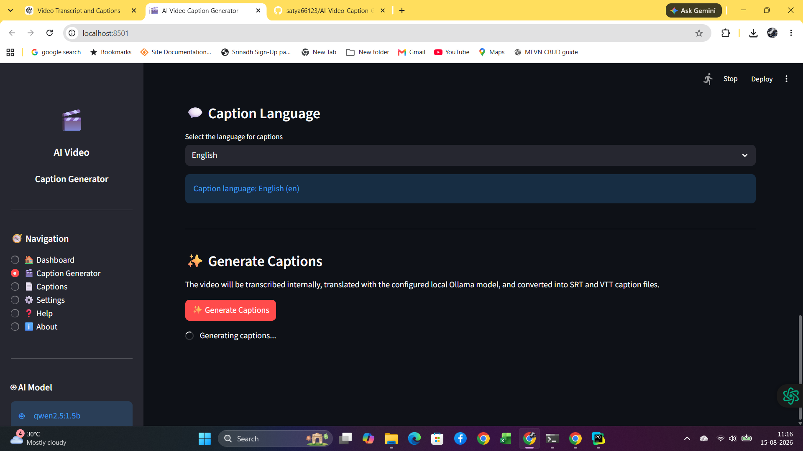
</p>

---

## ✅ Captions Generated Successfully

Generated SRT and VTT captions.

<p align="center">
  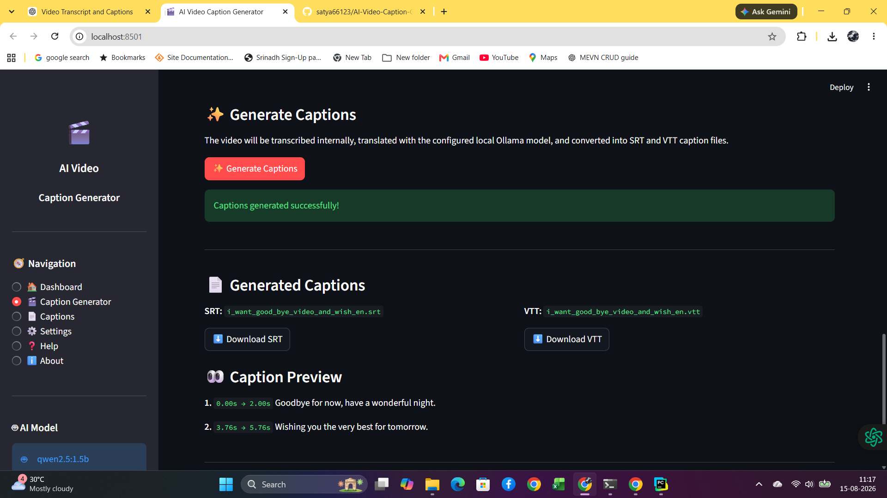
</p>

---

## 📄 Captions

Generated subtitle files and caption information.

<p align="center">
  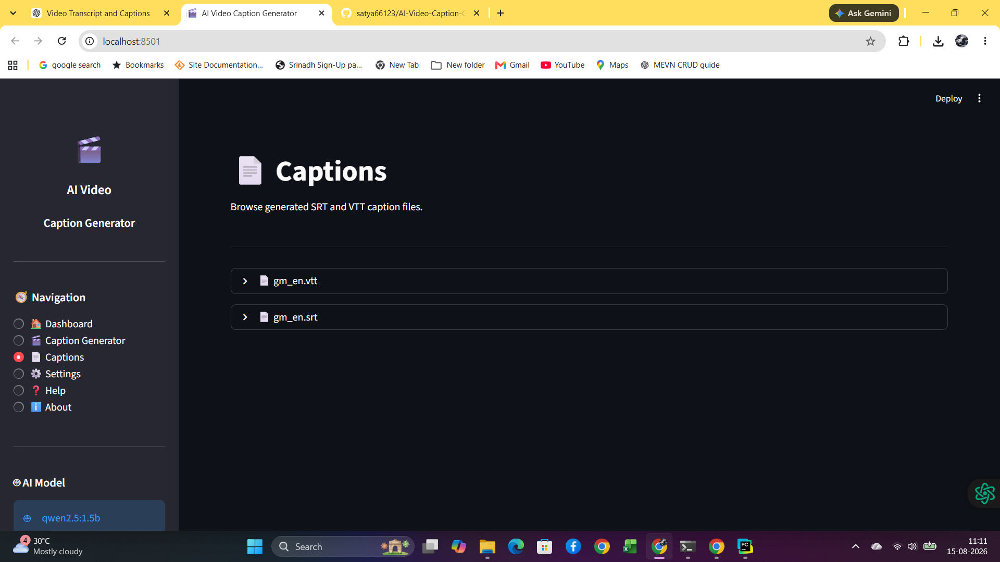
</p>

---

## 🔥 Caption Burning

FFmpeg permanently burns the selected captions into the video.

<p align="center">
  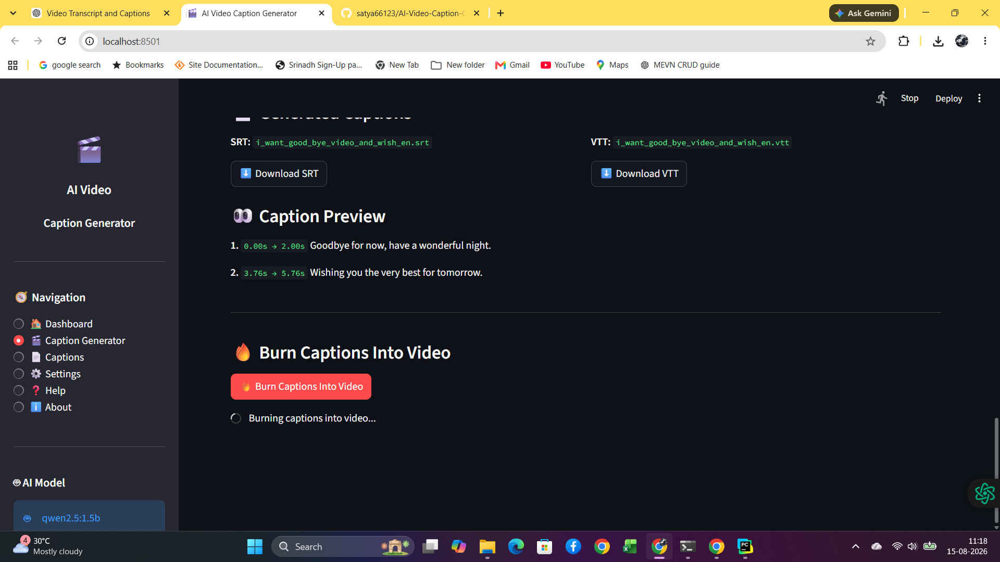
</p>

---

## 🎥 Captioned Video

Final video with captions permanently embedded.

<p align="center">
  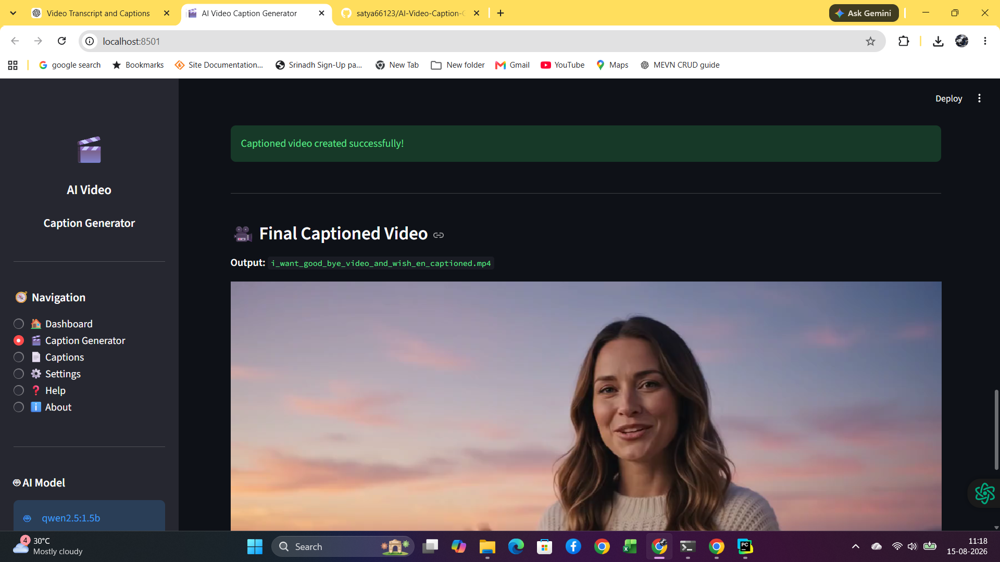
</p>

---

## ⚙️ Settings

Configure Whisper, AI providers, models and the default caption language.

<p align="center">
  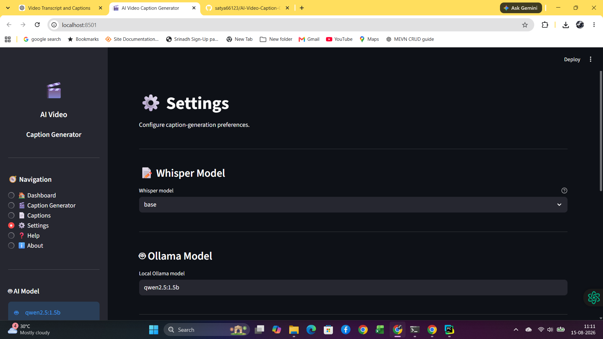
</p>

---

## ❓ Help

Application usage instructions and troubleshooting information.

<p align="center">
  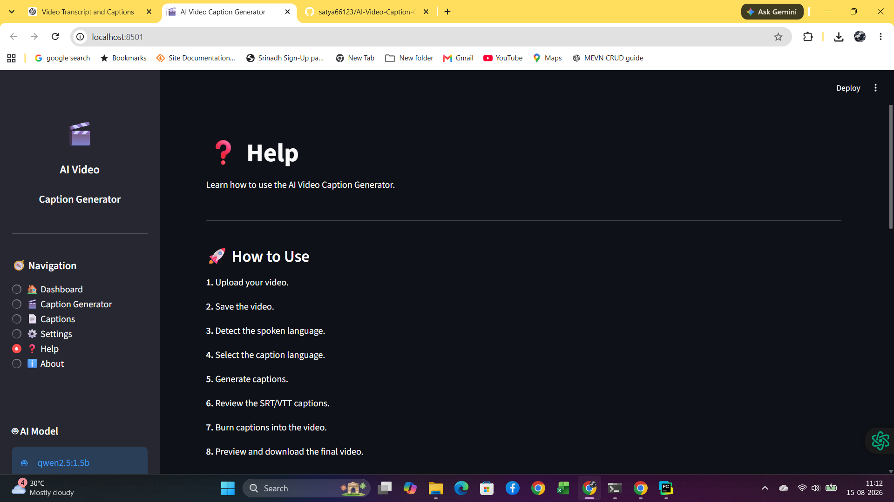
</p>

---

## ℹ️ About

Project overview, workflow and technology information.

<p align="center">
  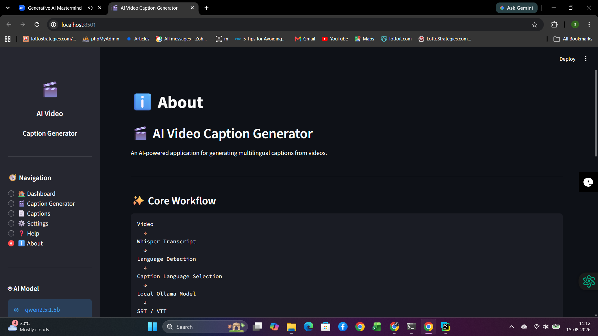
</p>

---

# 💾 Generated Files

The application uses local directories:

```text
uploads/
    original video files

transcripts/
    timestamped transcript files

captions/
    *.srt
    *.vtt

outputs/
    captioned video files
```

The original uploaded video is preserved separately from the captioned output.

---

# 🔐 Privacy and Processing

The application supports local-first processing through Ollama.

When Ollama is selected, translation processing can be performed through the locally running Ollama service.

When a cloud provider is selected, the relevant translation request is sent to that provider's API.

Users should review the configuration, privacy policies and terms of any third-party services they choose to use.

API keys are loaded from environment variables and are not displayed in the application UI.

---

# ⚠️ Requirements

Before running the complete workflow, ensure:

* Python 3.11 is installed
* Required Python dependencies are installed
* FFmpeg is installed and available on `PATH`
* Ollama is installed for local translation
* Required Ollama models are available when using Ollama
* Required cloud API keys are configured when using cloud providers
* Sufficient disk space is available for videos and generated outputs

---

# 🛠️ Troubleshooting

## Ollama Connection Error

Verify:

```powershell
ollama --version
ollama list
ollama serve
```

## Translation Model Missing

Install the selected model:

```powershell
ollama pull qwen2.5:1.5b
```

Check installed models:

```powershell
ollama list
```

## Cloud Provider API Key Missing

Check the corresponding environment variable:

```env
OPENAI_API_KEY=
ANTHROPIC_API_KEY=
GEMINI_API_KEY=
MISTRAL_API_KEY=
GROQ_API_KEY=
COHERE_API_KEY=
DEEPSEEK_API_KEY=
```

## FFmpeg Not Found

Verify:

```powershell
ffmpeg -version
```

Make sure FFmpeg is available on the system `PATH`.

## Tests Fail Locally

Activate the virtual environment:

```powershell
.venv\Scripts\activate
```

Reinstall dependencies:

```powershell
pip install -r requirements.txt
```

Run:

```powershell
pytest -v
```

---

# 📌 Development Status

## Core Application

**Complete ✅**

The implemented workflow produces:

* Original saved video
* SRT captions
* VTT captions
* Final captioned video

## Multi-Provider Translation

**Complete ✅**

Supported providers:

* Ollama
* OpenAI
* Anthropic
* Gemini
* Mistral
* Groq
* Cohere
* DeepSeek

## Multi-Model Selection

**Complete in v1.3.0 ✅**

Users can:

* Select an AI provider
* View models available for that provider
* Select an AI model
* Use the selected provider/model for translation

## Automated Testing

**Complete ✅**

```text
231 passed
0 failed
100% pass rate
21.39 seconds
```

## Theme Selection

**Complete in v1.4.0 ✅**

Users can:

* Select an application theme from the sidebar
* Use Dark, Midnight Blue, Cosmic Purple, Ocean, or Emerald themes
* Apply the selected theme during the current Streamlit session

## GitHub CI

**Passing ✅**

The GitHub Actions test workflow is passing.

---

# 🚀 v1.4.1 Release

v1.4.1 introduces the new tab-based frontend, expanded theme system,
and enhanced multi-model AI Settings while preserving the existing
caption-generation core.

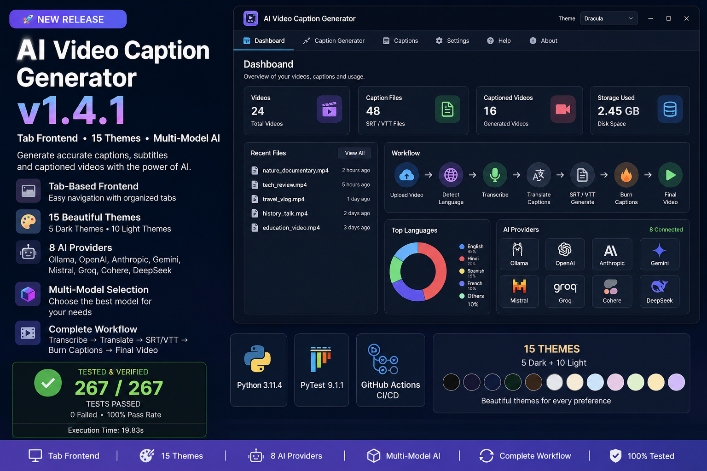

[](https://github.com/satya66123/AI-Video-Caption-Generator/releases/tag/v1.4.1)
[](https://github.com/satya66123/AI-Video-Caption-Generator/actions)
[](https://github.com/satya66123/AI-Video-Caption-Generator)
[](https://github.com/satya66123/AI-Video-Caption-Generator)

## v1.4.1 Features

- 🖥️ Tab-based frontend using `apptab.py`
- 🏠 Dashboard remains the default tab
- 🎬 Caption Generator tab
- 📄 Captions tab
- ⚙️ Settings tab
- ❓ Help tab
- ℹ️ About tab
- 🎨 **15 application themes**
- 🌙 5 dark themes
- ☀️ 10 light themes
- 🖤 Improved text visibility for light themes
- 🔽 Improved dropdown/selectbox text visibility
- 📝 Improved caption text visibility
- 🕐 Improved Recent Files readability
- 🤖 **8 AI providers**
- 🧠 Multiple models per provider
- 🔀 Dynamic Provider → Model selection
- 🌐 Original spoken-language detection
- 📄 SRT and VTT generation preserved
- 🔥 FFmpeg caption burning preserved
- 💾 Original video preservation preserved
- 🛠️ Help and Troubleshooting expanded
- ℹ️ About documentation expanded
- 📁 Project folder documentation added
- 🧪 **267 automated tests passing**

## v1.4.1 Verification

```text
267 passed
0 failed
100% pass rate
19.83 seconds
```

---


# 🗺️ Future Improvements

Possible future enhancements include:

* Caption editing before export
* More translation providers
* Additional AI models
* Additional caption formats
* Batch video processing
* Caption style customization
* Subtitle positioning controls
* Advanced video/audio metadata
* Job progress tracking
* Improved output management
* Additional language support

These are future possibilities and are not required for the current completed workflow.

---

# 🤝 Contributing

Contributions are welcome.

General workflow:

1. Fork the repository
2. Create a feature branch
3. Implement your changes
4. Add or update tests
5. Run the full test suite
6. Verify the application manually when applicable
7. Commit your changes
8. Open a pull request

Before submitting changes:

```powershell
pytest
```

must pass successfully.

---

# 📜 License

This project is licensed under the MIT License.

Copyright (c) 2026 Nekkanti Satya Srinath

See the `LICENSE` file for the complete license text.

---

# 👤 Author

**Nekkanti Satya Srinath**

AI / Full-Stack Developer

* GitHub: https://github.com/satya66123
* LinkedIn: https://www.linkedin.com/in/satya-srinath-nekkanti-08b012a3/

---

# 📫 Contact

**Nekkanti Satya Srinath**

For project questions, issues, feature requests, or collaboration, please use the GitHub repository's Issues or
Discussions where available.

---

# ⭐ Acknowledgements

This project uses and builds upon open-source technologies including:

* Python
* Streamlit
* OpenAI Whisper
* Ollama
* Qwen
* Gemma
* FFmpeg
* PyTest
* GitHub Actions

Please review the individual licenses and terms of the third-party technologies and models used by your installation.

---

# 📋 Project Summary

**AI Video Caption Generator** is an AI-powered application that transforms videos into multilingual captioned videos.

The project evolved through five major stable releases:

```text
v1.0.0
Ollama-Based Core
One Local Model
        ↓
v1.1.0
Multi-Provider AI
One Default Model per Provider
        ↓
v1.2.0
Multi-Provider + Timestamped Transcript Saving
        ↓
v1.3.0
Multi-Provider + Multi-Model AI
Provider + Model Selection
        ↓
v1.4.0
Custom Application Theme Selection
        ↓
v1.4.1
Tab-Based Frontend + 15 Themes + Multi-Model Settings
```

## Complete Workflow

```text
Upload
  ↓
Save Original Video
  ↓
Transcribe
  ↓
Detect Language
  ↓
Select Caption Language
  ↓
Select Provider
  ↓
Select Model
  ↓
Translate
  ↓
Generate SRT + VTT
  ↓
Burn Captions
  ↓
Download Final Video
```

---

# 🎬 v1.0.0 Release

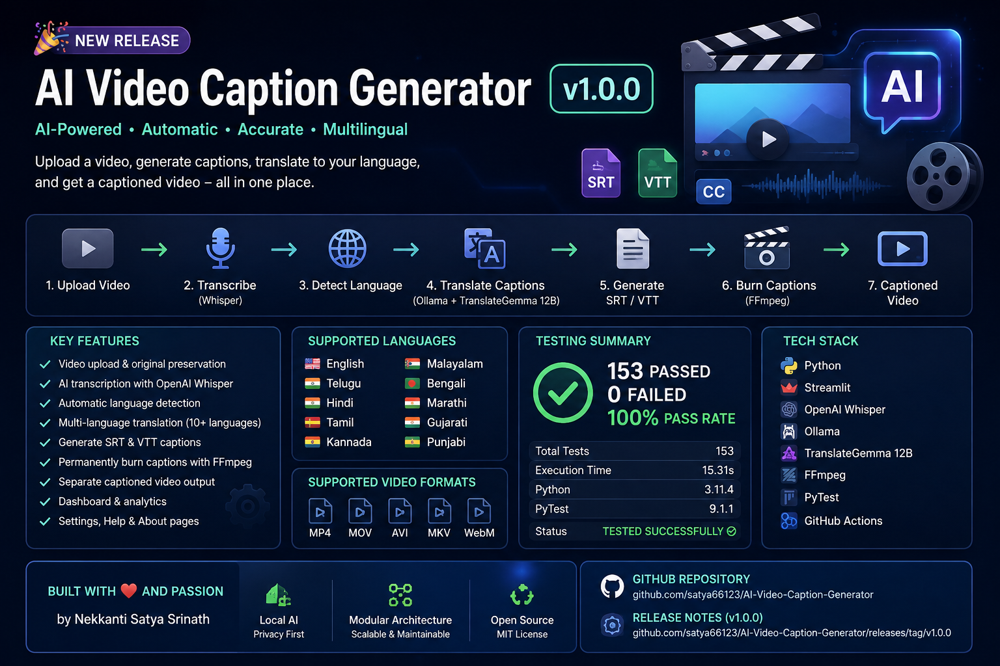

[](https://github.com/satya66123/AI-Video-Caption-Generator/actions)
[](https://github.com/satya66123/AI-Video-Caption-Generator)
[](https://github.com/satya66123/AI-Video-Caption-Generator/releases/tag/v1.0.0)

**Original release:** Ollama-based local AI caption generation.

---

# 🚀 v1.1.0 Release

v1.1.0 introduced multi-provider AI translation.
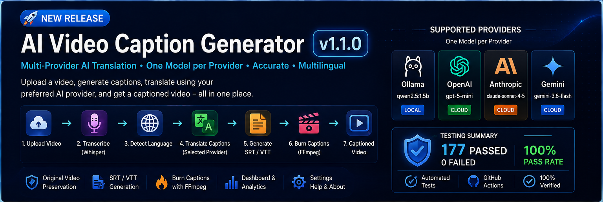
[](https://github.com/satya66123/AI-Video-Caption-Generator/actions)
[](https://github.com/satya66123/AI-Video-Caption-Generator)
[](https://github.com/satya66123/AI-Video-Caption-Generator/releases/tag/v1.1.0)

```text
Ollama
OpenAI
Anthropic
Gemini
```

Each provider used one configured/default translation model.

---

# 🚀 v1.2.0 Release

v1.2.0 introduced persistent timestamped transcript saving while retaining the multi-provider architecture with one
configured/default model per provider.
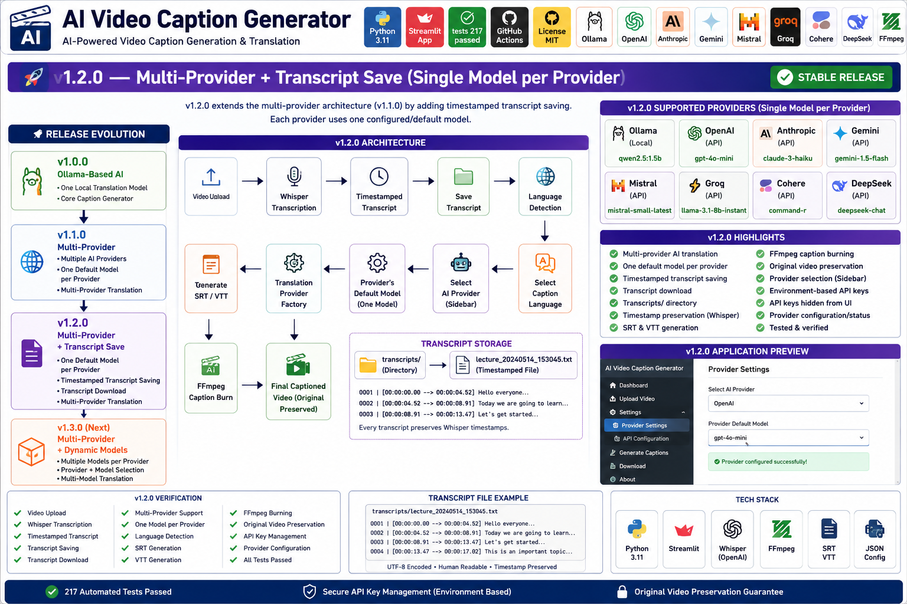
[](https://github.com/satya66123/AI-Video-Caption-Generator)
[](https://github.com/satya66123/AI-Video-Caption-Generator/releases/tag/v1.3.0)

### v1.2.0 Features

* 🤖 Multi-provider AI translation
* 🎯 One default model per provider
* 📝 Timestamped transcript saving
* ⬇️ Transcript download
* ⏱️ Whisper timestamp preservation
* 📄 SRT/VTT generation
* 🔥 FFmpeg caption burning
* 💾 Original video preservation

```text
Provider
   ↓
One Default Model
   ↓
Whisper Transcript
   ↓
Timestamped Transcript Save
   ↓
Translation
   ↓
SRT / VTT
   ↓
FFmpeg
   ↓
Captioned Video
```

---

# 🚀 v1.3.0 Release

v1.3.0 introduces:

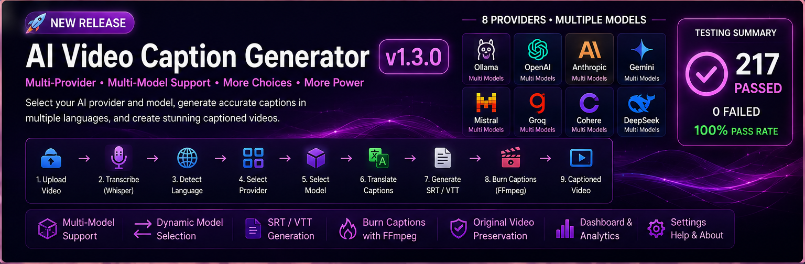
[](https://github.com/satya66123/AI-Video-Caption-Generator/actions)
[](https://github.com/satya66123/AI-Video-Caption-Generator)
[](https://github.com/satya66123/AI-Video-Caption-Generator/releases/tag/v1.3.0)

```text
8 AI Providers
      +
Multiple Models per Provider
      +
Provider Selection
      +
Model Selection
```

The application now supports dynamic:

```text
Provider → Available Models → Selected Model
```

This is the major evolution from the v1.1.0 architecture.

---

# 🚀 v1.4.0 Release

v1.4.0 introduces customizable application themes in the sidebar.

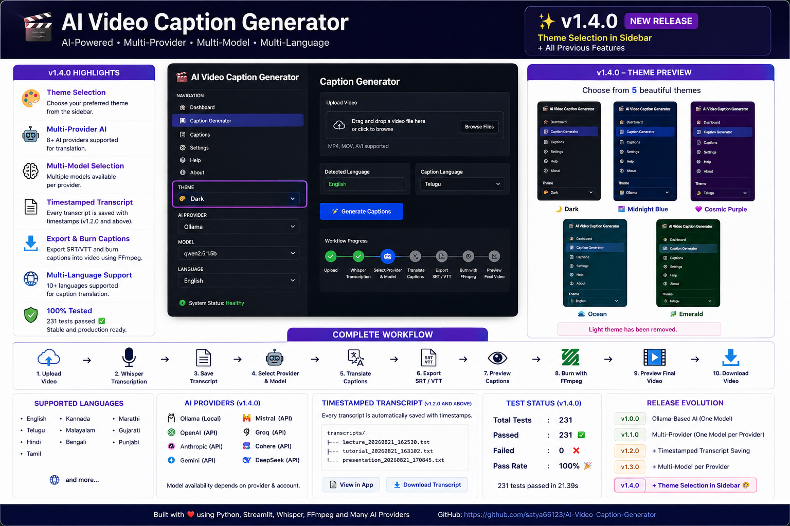
[](https://github.com/satya66123/AI-Video-Caption-Generator/releases/tag/v1.4.0)
[](https://github.com/satya66123/AI-Video-Caption-Generator/actions)
[](https://github.com/satya66123/AI-Video-Caption-Generator)

### v1.4.0 Features

* 🎨 Theme selection from the sidebar
* 🌙 Dark
* 🌌 Midnight Blue
* 💜 Cosmic Purple
* 🌊 Ocean
* 🌿 Emerald
* ❌ Light theme removed
* 🧠 Dynamic model selection preserved
* 🤖 Multi-provider AI preserved
* 📝 Timestamped transcript saving preserved
* ⬇️ Transcript download preserved

### v1.4.0 Verification

```text
231 passed
0 failed
100% pass rate
21.39 seconds
```

---

---

# 🚀 v1.4.1 Release

v1.4.1 introduces the new tab-based frontend, expanded theme system,
and enhanced multi-model AI Settings while preserving the existing
caption-generation core.


[](https://github.com/satya66123/AI-Video-Caption-Generator/releases/tag/v1.4.1)
[](https://github.com/satya66123/AI-Video-Caption-Generator/actions)
[](https://github.com/satya66123/AI-Video-Caption-Generator)
[](https://github.com/satya66123/AI-Video-Caption-Generator)

## v1.4.1 Features

- 🖥️ Tab-based frontend using `apptab.py`
- 🏠 Dashboard remains the default tab
- 🎬 Caption Generator tab
- 📄 Captions tab
- ⚙️ Settings tab
- ❓ Help tab
- ℹ️ About tab
- 🎨 **15 application themes**
- 🌙 5 dark themes
- ☀️ 10 light themes
- 🖤 Improved text visibility for light themes
- 🔽 Improved dropdown/selectbox text visibility
- 📝 Improved caption text visibility
- 🕐 Improved Recent Files readability
- 🤖 **8 AI providers**
- 🧠 Multiple models per provider
- 🔀 Dynamic Provider → Model selection
- 🌐 Original spoken-language detection
- 📄 SRT and VTT generation preserved
- 🔥 FFmpeg caption burning preserved
- 💾 Original video preservation preserved
- 🛠️ Help and Troubleshooting expanded
- ℹ️ About documentation expanded
- 📁 Project folder documentation added
- 🧪 **267 automated tests passing**

## v1.4.1 Verification

```text
267 passed
0 failed
100% pass rate
19.83 seconds
```

# 🏆 Stable Release Summary

```text
AI Video Caption Generator
────────────────────────────────────────

v1.0.0 → Core Ollama Caption Generator
          One Local Translation Model
          Stable ✅

v1.1.0 → Multi-Provider AI Translation
          One Default Model per Provider
          Stable ✅

v1.3.0 → Multi-Provider + Multi-Model AI
          Multiple Models per Provider
          Provider + Model Selection
          Stable ✅
v1.4.0 → Mutli themes dark(5)
          Stable  ✅

v1.4.1 → Multi front-end (tab + sidebar navigation)
         + Multi themes (dark-5 + light 10)
          Stable ✅

────────────────────────────────────────

Automated Tests: 267 passed
Failed Tests: 0
Pass Rate: 100%
GitHub Actions: Passing

Current Stable Release: v1.4.1 🚀
```

**v1.0.0** remains documented as the original Ollama-based core release.

**v1.1.0** introduced multi-provider AI translation with one default model per provider.

**v1.2.0** introduced timestamped transcript saving.

**v1.3.0** adds multi-model support, allowing users to select both the AI provider and the model used for translation.

**v1.4.0** adds custom application theme selection from the sidebar.

## Current Stable Release

# 🚀 v1.4.1

**Tab Frontend + 15 Themes + Multi-Provider + Multi-Model AI Translation**

**Status: Stable ✅**

**Tests: 267 passed ✅**

**GitHub Actions: Passing ✅**

